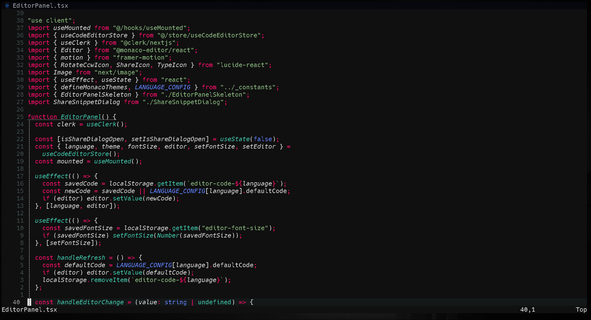
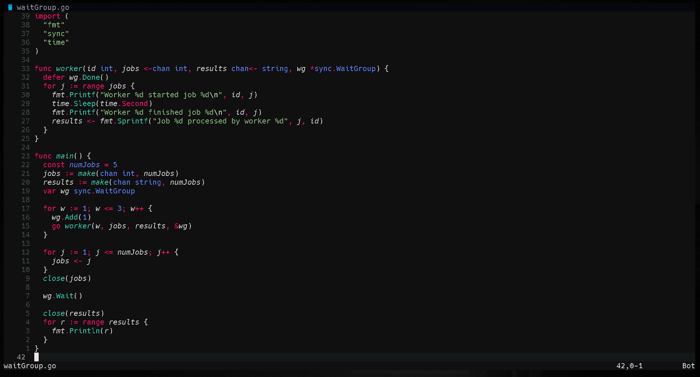

  

  # vsc.eezzy
  A neovim theme available in dark and light
  
   
  

## Installation

Install theme from the [Marketplace](https://marketplace.visualstudio.com/items?itemName=ashish2508.vsc-eezzy-nvim)

## License

[MIT License](LICENSE) 
